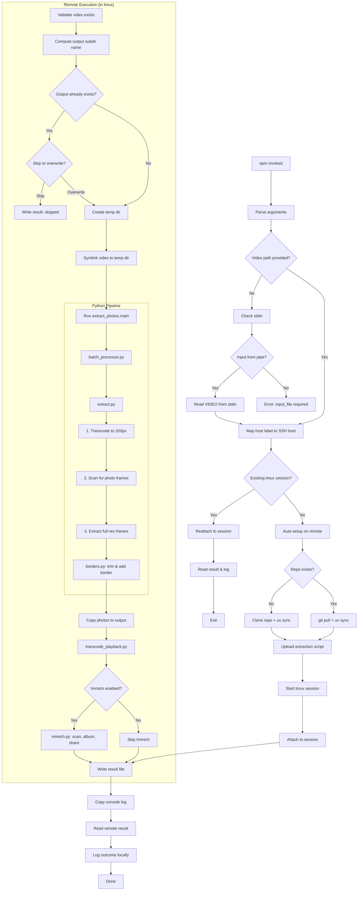
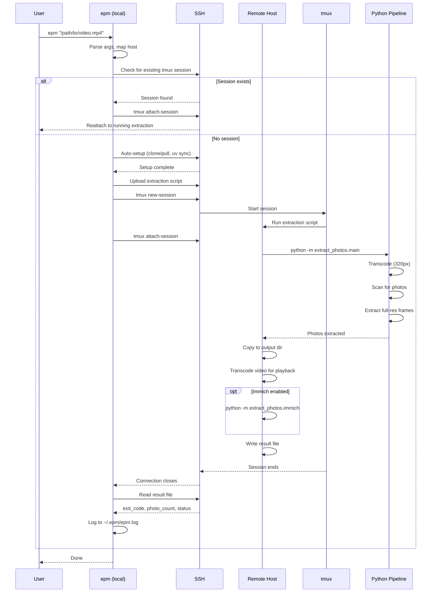

# EPM Code Flow Diagrams

## Flowchart (Main Control Flow)

## Sequence Diagram (Local ↔ Remote Interaction)

## Python Pipeline Detail

```mermaid
flowchart LR
    subgraph main.py
        A[Parse CLI args]
    end

    subgraph batch_processor.py
        B[Find video files] --> C[For each video]
        C --> D[Check existing output]
        D --> E[Create output subdir]
    end

    subgraph extract.py
        F[transcode_lowres] --> G[scan_for_photos]
        G --> H[extract_fullres_frames]

        G --> G1[Step through frames]
        G1 --> G2[Detect uniform borders]
        G2 --> G3[Reject near-uniform]
        G3 --> G4[Perceptual hash dedup]
        G4 --> G5[Collect timestamps]

        H --> H1[Seek to timestamp]
        H1 --> H2[Validate frame]
        H2 --> H3[trim_and_add_border]
        H3 --> H4[Save JPEG]
    end

    A --> B
    E --> F
    H4 --> I[Return photo count]
```

## Notes

These diagrams use Mermaid syntax. To render them:
- **GitHub**: Paste into any `.md` file - GitHub renders Mermaid natively
- **VS Code**: Install "Markdown Preview Mermaid Support" extension
- **CLI**: Use `mmdc` (mermaid-cli): `npm install -g @mermaid-js/mermaid-cli`
- **Online**: Paste into https://mermaid.live

The flowchart shows the complete decision tree through `epm`. The sequence diagram emphasizes the local↔remote handoff and resilience model (tmux). The Python pipeline detail zooms into the three-phase extraction process.
