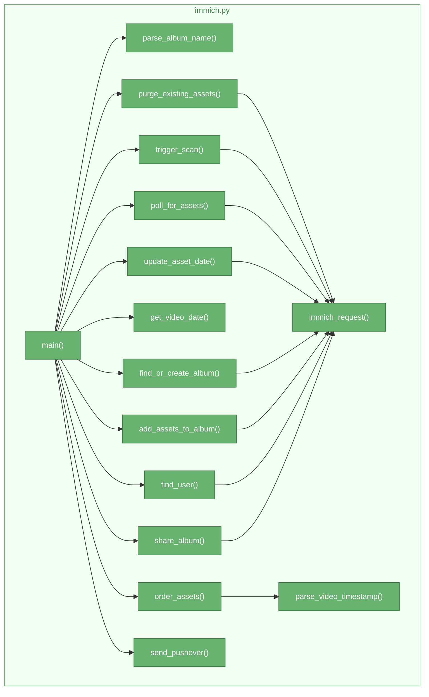
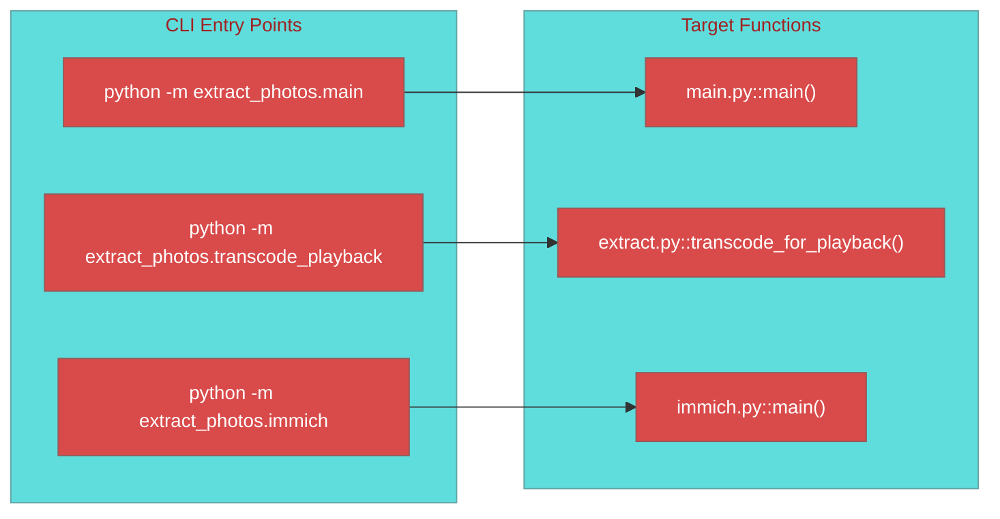

# Manual Call Graph

Hand-crafted Mermaid diagram showing function call relationships.

**Pros:** Clean, readable, shows only important relationships
**Cons:** Requires manual updates when code changes

## Main Pipeline

```mermaid
%%{init: {
  'theme': 'base',
  'themeVariables': {
    'primaryColor': '#4a90d9',
    'primaryTextColor': '#ffffff',
    'primaryBorderColor': '#2d5a87',
    'lineColor': '#333333',
    'fontSize': '14px',
    'clusterBkg': '#f0f7ff',
    'clusterBorder': '#4a90d9'
  }
}}%%
flowchart TB
    subgraph main_py["main.py"]
        main["main()"]
    end

    subgraph batch["batch_processor.py"]
        process_videos["process_videos_in_directory()"]
        has_existing["_has_existing_output()"]
    end

    subgraph extract["extract.py"]
        extract_photos["extract_photos_from_video()"]
        get_metadata["get_video_metadata()"]
        transcode_lowres["transcode_lowres()"]
        scan_photos["scan_for_photos()"]
        extract_frames["extract_fullres_frames()"]

        detect_borders["detect_almost_uniform_borders()"]
        compute_hash["compute_frame_hash()"]
        hash_diff["hash_difference()"]
        is_near_uniform["_is_near_uniform()"]
        rejection_reason["_rejection_reason()"]
        is_screenshot["_is_screenshot()"]
        white_bg_pct["_white_background_percentage()"]

        transcode_playback["transcode_for_playback()"]
        is_vaapi["_is_vaapi_available()"]
        playback_args["_playback_encode_args()"]
        lowres_args["_lowres_encode_args()"]
        read_progress["_read_ffmpeg_progress()"]
    end

    subgraph borders_py["borders.py"]
        trim_border["trim_and_add_border()"]
        detect_text["_detect_text_padding()"]
        find_gap["_find_text_gap_from_edge()"]
    end

    subgraph utils_py["utils.py"]
        safe_folder["make_safe_folder_name()"]
        setup_logger["setup_logger()"]
    end

    subgraph display["display_progress.py"]
        format_time["format_time()"]
        progress_bar["build_progress_bar()"]
        print_progress["print_scan_progress()"]
    end

    %% Main flow
    main --> process_videos
    process_videos --> safe_folder
    process_videos --> has_existing
    process_videos --> extract_photos

    %% extract_photos_from_video internals
    extract_photos --> safe_folder
    extract_photos --> setup_logger
    extract_photos --> get_metadata
    extract_photos --> transcode_lowres
    extract_photos --> scan_photos
    extract_photos --> extract_frames

    %% transcode_lowres
    transcode_lowres --> lowres_args
    transcode_lowres --> read_progress
    transcode_lowres --> format_time
    transcode_lowres --> progress_bar

    %% scan_for_photos
    scan_photos --> detect_borders
    scan_photos --> is_near_uniform
    scan_photos --> compute_hash
    scan_photos --> hash_diff
    scan_photos --> format_time
    scan_photos --> print_progress

    %% print_scan_progress
    print_progress --> progress_bar
    print_progress --> format_time

    %% extract_fullres_frames
    extract_frames --> trim_border
    extract_frames --> rejection_reason

    %% rejection_reason
    rejection_reason --> is_near_uniform
    rejection_reason --> is_screenshot
    is_screenshot --> white_bg_pct

    %% borders
    trim_border --> detect_text
    detect_text --> find_gap

    %% transcode_for_playback (separate entry)
    transcode_playback --> is_vaapi
    transcode_playback --> playback_args
    transcode_playback --> read_progress
    transcode_playback --> format_time
    transcode_playback --> progress_bar
```

## Immich Integration (Separate Pipeline)

## CLI Entry Points

[← Back to Architecture Index](../ARCHITECTURE.md)
