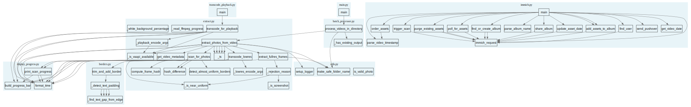

# Auto-Generated Call Graph (AST Analysis)

Function-level call graph generated via Python AST analysis.

**Pros:** Automatic, shows all function-to-function calls, updates by re-running script
**Cons:** Can be noisy, includes internal calls, no semantic grouping

## Generated Files

- `callgraph.dot` - Graphviz DOT format
- `callgraph.svg` - Rendered SVG image

## Regenerate

```bash
uv run python -c "
import ast
import os

def analyze_module(filepath):
    with open(filepath) as f:
        tree = ast.parse(f.read())

    module_name = os.path.basename(filepath).replace('.py', '')
    functions = {}

    for node in ast.walk(tree):
        if isinstance(node, ast.FunctionDef):
            func_name = node.name
            calls = []
            for child in ast.walk(node):
                if isinstance(child, ast.Call):
                    if isinstance(child.func, ast.Name):
                        calls.append(child.func.id)
                    elif isinstance(child.func, ast.Attribute):
                        calls.append(child.func.attr)
            functions[func_name] = calls

    return module_name, functions

modules = {}
for f in sorted(os.listdir('extract_photos')):
    if f.endswith('.py') and not f.startswith('__'):
        path = os.path.join('extract_photos', f)
        name, funcs = analyze_module(path)
        modules[name] = funcs

print('digraph callgraph {')
print('  rankdir=TB;')
print('  node [shape=box, fontname=\"Helvetica\"];')
print('  edge [color=\"#666666\"];')
print()

all_funcs = set()
for mod, funcs in modules.items():
    all_funcs.update(funcs.keys())

for mod, funcs in modules.items():
    print(f'  subgraph cluster_{mod} {{')
    print(f'    label=\"{mod}.py\";')
    print('    style=filled;')
    print('    color=\"#e8f4f8\";')
    for func in funcs:
        print(f'    \"{mod}:{func}\" [label=\"{func}\"];')
    print('  }')
    print()

for mod, funcs in modules.items():
    for func, calls in funcs.items():
        for call in calls:
            for target_mod, target_funcs in modules.items():
                if call in target_funcs:
                    print(f'  \"{mod}:{func}\" -> \"{target_mod}:{call}\";')
                    break

print('}')
" > docs/callgraph-pyan/callgraph.dot

dot -Tsvg docs/callgraph-pyan/callgraph.svg -o docs/callgraph-pyan/callgraph.svg
```

## Preview



[← Back to Architecture Index](../ARCHITECTURE.md)
