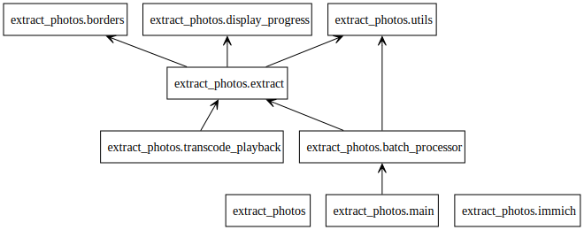

# Auto-Generated UML (pyreverse)

Module dependency diagram generated via pylint's pyreverse.

**Pros:** Shows module-level imports, standard UML notation
**Cons:** Module-level only (no function calls), class diagram empty for this project (no classes)

## Generated Files

- `packages_extract_photos.dot` - Module dependencies (Graphviz DOT)
- `packages.svg` - Rendered SVG
- `classes_extract_photos.dot` - Class diagram (empty - no classes in this project)

## Regenerate

```bash
uv run python -m pylint.pyreverse.main -o dot -p extract_photos extract_photos/
mv classes_extract_photos.dot packages_extract_photos.dot docs/callgraph-pyreverse/
dot -Tsvg docs/callgraph-pyreverse/packages_extract_photos.dot -o docs/callgraph-pyreverse/packages.svg
```

## Module Dependencies

```
main.py
  └─> batch_processor.py
        ├─> extract.py
        │     ├─> borders.py
        │     ├─> display_progress.py
        │     └─> utils.py
        └─> utils.py

transcode_playback.py
  └─> extract.py

immich.py (standalone)
```

## Preview



[← Back to Architecture Index](../ARCHITECTURE.md)
