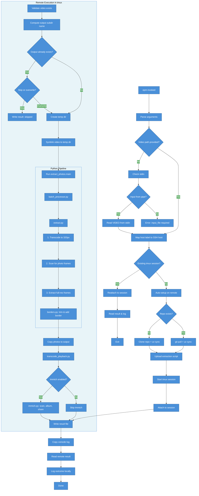

# EPM Control Flow

Main decision tree through `epm` from invocation to completion.

```mermaid
%%{init: {
  'theme': 'base',
  'themeVariables': {
    'primaryColor': '#4a90d9',
    'primaryTextColor': '#ffffff',
    'primaryBorderColor': '#2d5a87',
    'secondaryColor': '#67b26f',
    'tertiaryColor': '#f5f5f5',
    'lineColor': '#333333',
    'textColor': '#333333',
    'fontSize': '16px',
    'nodeBorder': '#2d5a87',
    'clusterBkg': '#e8f4f8',
    'clusterBorder': '#4a90d9'
  }
}}%%
flowchart TD
    A[epm invoked] --> B[Parse arguments]
    B --> C{Video path provided?}
    C -->|No| D[Check stdin]
    D --> E{Input from pipe?}
    E -->|Yes| F[Read VIDEO from stdin]
    E -->|No| G[Error: input_file required]
    C -->|Yes| H[Map host label to SSH host]
    F --> H

    H --> I{Existing tmux session?}
    I -->|Yes| J[Reattach to session]
    J --> K[Read result & log]
    K --> L[Exit]

    I -->|No| M[Auto-setup on remote]
    M --> N{Repo exists?}
    N -->|No| O[Clone repo + uv sync]
    N -->|Yes| P[git pull + uv sync]
    O --> Q[Upload extraction script]
    P --> Q

    Q --> R[Start tmux session]
    R --> S[Attach to session]

    subgraph Remote["Remote Execution in tmux"]
        T[Validate video exists] --> U[Compute output subdir name]
        U --> V{Output already exists?}
        V -->|Yes| W{Skip or overwrite?}
        W -->|Skip| X[Write result: skipped]
        W -->|Overwrite| Y[Create temp dir]
        V -->|No| Y

        Y --> Z[Symlink video to temp dir]
        Z --> AA[Run extract_photos.main]

        subgraph Python["Python Pipeline"]
            AA --> BB[batch_processor.py]
            BB --> CC[extract.py]
            CC --> DD[1. Transcode to 320px]
            DD --> EE[2. Scan for photo frames]
            EE --> FF[3. Extract full-res frames]
            FF --> GG[borders.py: trim & add border]
        end

        GG --> HH[Copy photos to output]
        HH --> II[transcode_playback.py]
        II --> JJ{Immich enabled?}
        JJ -->|Yes| KK[immich.py: scan, album, share]
        JJ -->|No| LL[Skip Immich]
        KK --> MM[Write result file]
        LL --> MM
    end

    S --> MM
    MM --> NN[Copy console log]
    NN --> OO[Read remote result]
    OO --> PP[Log outcome locally]
    PP --> QQ[Done]
```

[← Back to Architecture Index](ARCHITECTURE.md)
