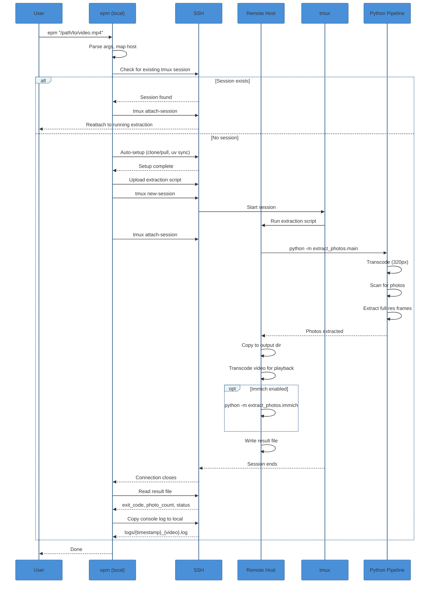

# EPM Sequence Diagram

Local ↔ remote interaction showing the SSH/tmux handoff and resilience model.

```mermaid
%%{init: {
  'theme': 'base',
  'themeVariables': {
    'primaryColor': '#4a90d9',
    'primaryTextColor': '#333333',
    'secondaryColor': '#67b26f',
    'tertiaryColor': '#f5f5f5',
    'lineColor': '#333333',
    'textColor': '#333333',
    'fontSize': '14px',
    'actorTextColor': '#333333',
    'actorBkg': '#4a90d9',
    'actorBorder': '#2d5a87',
    'signalColor': '#333333',
    'signalTextColor': '#333333',
    'labelBoxBkgColor': '#e8f4f8',
    'labelTextColor': '#333333',
    'noteBkgColor': '#fff3cd',
    'noteTextColor': '#333333'
  },
  'sequence': {
    'actorFontSize': 14,
    'messageFontSize': 13,
    'noteFontSize': 12
  }
}}%%
sequenceDiagram
    participant User
    participant epm as epm (local)
    participant SSH
    participant Remote as Remote Host
    participant tmux
    participant Python as Python Pipeline

    User->>epm: epm "/path/to/video.mp4"
    epm->>epm: Parse args, map host

    epm->>SSH: Check for existing tmux session

    alt Session exists
        SSH-->>epm: Session found
        epm->>SSH: tmux attach-session
        SSH-->>User: Reattach to running extraction
    else No session
        epm->>SSH: Auto-setup (clone/pull, uv sync)
        SSH-->>epm: Setup complete

        epm->>SSH: Upload extraction script
        epm->>SSH: tmux new-session
        SSH->>tmux: Start session
        tmux->>Remote: Run extraction script

        epm->>SSH: tmux attach-session

        Remote->>Python: python -m extract_photos.main
        Python->>Python: Transcode (320px)
        Python->>Python: Scan for photos
        Python->>Python: Extract full-res frames
        Python-->>Remote: Photos extracted

        Remote->>Remote: Copy to output dir
        Remote->>Remote: Transcode video for playback

        opt Immich enabled
            Remote->>Remote: python -m extract_photos.immich
        end

        Remote->>Remote: Write result file
        tmux-->>SSH: Session ends
        SSH-->>epm: Connection closes

        epm->>SSH: Read result file
        SSH-->>epm: exit_code, photo_count, status
        epm->>SSH: Copy console log to local
        SSH-->>epm: logs/{timestamp}_{video}.log
    end

    epm-->>User: Done
```

[← Back to Architecture Index](ARCHITECTURE.md)
