# Python Pipeline Detail

The three-phase extraction process: transcode → scan → extract.

```mermaid
%%{init: {
  'theme': 'base',
  'themeVariables': {
    'primaryColor': '#4a90d9',
    'primaryTextColor': '#ffffff',
    'primaryBorderColor': '#2d5a87',
    'secondaryColor': '#67b26f',
    'tertiaryColor': '#f5f5f5',
    'lineColor': '#333333',
    'textColor': '#333333',
    'fontSize': '16px',
    'nodeBorder': '#2d5a87',
    'clusterBkg': '#e8f4f8',
    'clusterBorder': '#4a90d9'
  }
}}%%
flowchart LR
    subgraph main["main.py"]
        A[Parse CLI args]
    end

    subgraph batch["batch_processor.py"]
        B[Find video files] --> C[For each video]
        C --> D[Check existing output]
        D --> E[Create output subdir]
    end

    subgraph extract["extract.py"]
        F[transcode_lowres] --> G[scan_for_photos]
        G --> H[extract_fullres_frames]

        G --> G1[Step through frames]
        G1 --> G2[Detect uniform borders]
        G2 --> G3[Reject near-uniform]
        G3 --> G4[Perceptual hash dedup]
        G4 --> G5[Collect timestamps]

        H --> H1[Seek to timestamp]
        H1 --> H2[Validate frame]
        H2 --> H3[trim_and_add_border]
        H3 --> H4[Save JPEG]
    end

    A --> B
    E --> F
    H4 --> I[Return photo count]
```

## Phase Details

### 1. Transcode (transcode_lowres)
Creates a 320px-wide low-resolution copy for fast scanning. Always uses software encoding (VAAPI overhead exceeds savings at this resolution).

### 2. Scan (scan_for_photos)
Single-threaded scan of the low-res copy:
- Steps through frames at configurable intervals
- Detects uniform borders indicating a photo frame
- Rejects near-uniform frames (black/white screens)
- Deduplicates via perceptual hashing (threshold 3 for adjacent, 10 for separated)
- Collects timestamps of unique photos

### 3. Extract (extract_fullres_frames)
Opens the original full-resolution video:
- Seeks to each discovered timestamp
- Runs border trimming via `borders.py`
- Validates: minimum area, near-uniform rejection, screenshot detection
- Saves as JPEG

[← Back to Architecture Index](ARCHITECTURE.md)
